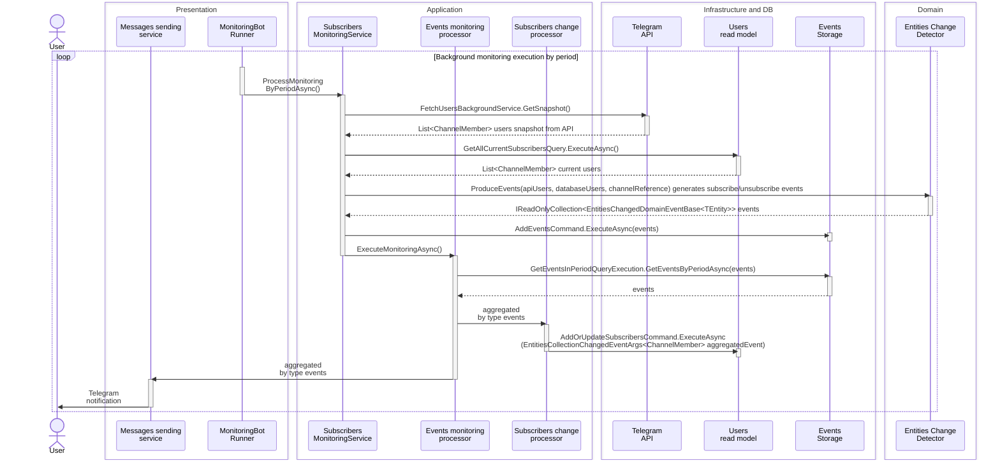

# Channel members monitoring Telegram-bot

This solution provides a mechanism for monitoring changes in the composition of entities anywhere. It can be adapted to work with collections of any type and integrated into any infrastructure. 

## Implementation Overview:
This solution is designed as a Telegram bot that:
- Monitors subscribers of a specified Telegram channel
- Detects and notifies about subscription changes (new joins or exits)
- Provides statistical and historical data on subscribers and related events
- Leverages Event Sourcing to maintain a complete audit trail of all changes

Thus, the bot’s core performs two main tasks:

1. Monitors and broadcasts notifications about changes in the subscriber list.
2. Processes user requests.

## Key Features

- Real-time tracking of channel membership changes
- Event-driven architecture with full history preservation
- Subscription analytics and historical event logging

## High-level Architecture

The **Domain** layer is conceptually represented as a mechanism for generating events based on changes in entity composition (additions or removals).

**Infrastructure** of the application depends on the Telegram API, provided by [WTelegramClient](https://wiz0u.github.io/WTelegramClient/). The interaction with the API is handled by an infrastructure background service that periodically requests the subscriber list. 

The database consists of:
- event store,
- channel subscribers store,
- subscribers read model. 

Data access is implemented via repositories.

The **Application** layer is responsible for processing domain events, executing pure commands and queries, as well as part of the bot’s core monitoring logic.

The **Presentation** layer contains the bot’s core logic and the mechanism for generating user-facing messages. Bot API is provided by [Telegram.BotAPI for .NET](https://github.com/Eptagone/Telegram.BotAPI).

## Subscriber Change Processing Flow

The bot's core executes the following sequence when handling channel membership changes:



## Setup and Deployment

This project can be deployed on any VPS/VDS server (or almost any). You need to clone the repository and set the necessary execute and read/write permissions for the folder.

Next, fill in your own data in the _appsettings.json_ file located in the _source/MonitoringBot/Configurations/_ directory (sample data is provided below):

```json
{
  "TelegramBot": {
    "BotToken": "your-bot-token",
    "ChatIdsCollection": [900000000],
    "CheckPeriodSeconds": 60
  },
  "TelegramApi": {
    "ApiId": "00000000",
    "ApiHash": "your-api-hash",
    "PhoneNumber": "+70000000000",
    "ChannelReferenceLink": "link to your public channel without t.me/"
  }
}
```

Fill the TelegramApi section according to the data obtained from the [official guide](https://core.telegram.org/api/obtaining_api_id).

The bot token is obtained when creating a bot via [BotFather](https://telegram.me/botfather).

To launch the bot, run the following command in the _path/to/project/source/MonitoringBot/_ directory:

```bash
dotnet run
```

> **❗ Warning!**  
>On first launch, you'll need to authorize via console by **entering the verification code** sent to the channel owner in Telegram. The session will then be saved to a _.session_ binary file in the output directory, and subsequent launches won't require additional authentication steps.