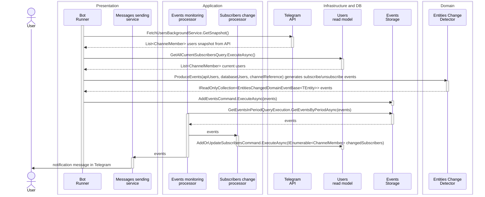

# Channel members monitoring telegram-bot

## Subscribers change processing

```mermaid
sequenceDiagram
	actor User

	box Presentation 
    participant BotRunner as Bot<br>Runner
    
    participant MessagesSendingService as Messages sending<br>service
    end

	box Application
    participant EventsMonitoringProcessor as Events monitoring<br>processor
    participant SubscribersChangeProcessor as Subscribers change<br>processor
    end
    
	box Infrastructure and DB
    participant TgApi as Telegram<br>API
    participant UsersReadModel as Users<br>read model
    participant EventsStorage as Events<br>Storage
    end

	box Domain
	participant ChangeDetector as Entities Change<br>Detector
	end
  

    activate BotRunner

	    BotRunner->>TgApi: FetchUsersBackgroundService.GetSnapshot()
	    activate TgApi
		TgApi -->> BotRunner: List<ChannelMember> users snapshot from API
		deactivate TgApi
	
	    BotRunner->>UsersReadModel: GetAllCurrentSubscribersQuery.ExecuteAsync()
	    activate UsersReadModel
	    UsersReadModel-->>BotRunner: List<ChannelMember> current users
	    deactivate UsersReadModel
	
		BotRunner ->> ChangeDetector: ProduceEvents(apiUsers, databaseUsers, channelReference) generates subscribe/unsubscribe events
		activate ChangeDetector
		ChangeDetector -->> BotRunner: IReadOnlyCollection<EntitiesChangedDomainEventBase<TEntity>> events
		deactivate ChangeDetector
	
		BotRunner ->> EventsStorage: AddEventsCommand.ExecuteAsync(events)
		activate EventsStorage
		deactivate EventsStorage
		EventsMonitoringProcessor ->> EventsStorage: GetEventsInPeriodQueryExecution.GetEventsByPeriodAsync(events)
		activate EventsStorage
		
		activate EventsMonitoringProcessor
		EventsStorage -->> EventsMonitoringProcessor: events
		deactivate EventsStorage
	
		EventsMonitoringProcessor ->> SubscribersChangeProcessor: events
		activate SubscribersChangeProcessor
		SubscribersChangeProcessor ->> UsersReadModel: AddOrUpdateSubscribersCommand.ExecuteAsync(IEnumerable<ChannelMember> changedSubscribers)
		activate UsersReadModel
		deactivate UsersReadModel
		deactivate SubscribersChangeProcessor
	
		EventsMonitoringProcessor ->> MessagesSendingService: events
		deactivate EventsMonitoringProcessor
		activate MessagesSendingService
		MessagesSendingService ->> User: notification message in Telegram
		deactivate MessagesSendingService

		
	deactivate BotRunner

```